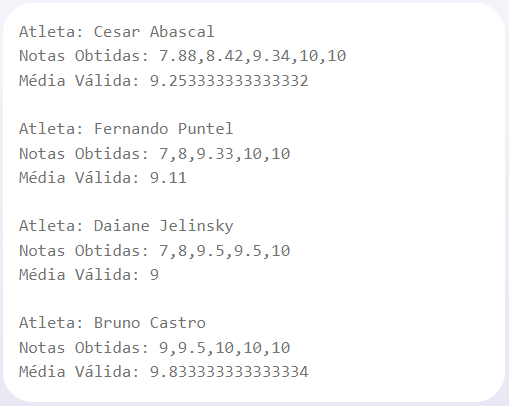

# Pontuação dos Atletas

> Projeto de Certificação 1 - Pontuação dos Atletas Esse projeto faz parte da "Trilha 1. Lógica de Programação", do curso DEVstart pertencente ao SENAI. Minha turma: FloripaMaisTec

## Problema Proposto

Aplicação capaz de receber o nome e as notas de um atleta, calcular a média e apresentar ao usuário.
Condições:
- 5 jurados avaliarão os atletas;
- Cada jurado pode fornecer uma nota de um (1) a dez (10);
- A média é calculada com base nas três notas do meio, desconsiderando a maior e menor nota.

### Especificações

Criar uma função capaz de receber uma matriz de objetos contendo o nome do atleta e as cinco notas atribuídas. A sua função deverá calcular a média das notas sem considerar a maior e menor nota do atleta. Por fim, deverá apresentar ao usuário o nome de cada atleta, seguido das notas e da média calculada.

## Solução do Problema:

- Variação da solução original. A proposta era através de uma função, por isso criei uma nova versão, desta vez resolvendo através do desenvolvimento da classe CompeticaoGinasticaArtistica(atletas).

### Entrada da Classe: argumento

- O argumento de criação da classe, "atletas" é uma matriz de objetos. Cada objeto contém nome (string) e matriz de notas (números).

###### Exemplo de entrada:

>let atletas = [
  {
    nome: "Nome_do_Atleta_1",
    notas: [10, 9.34, 8.42, 10, 7.88]
  },
  {
    nome: "Nome_do_Atleta_2",
    notas:  [8, 10, 10, 7, 9.33]
  }]

### Saída

- Exibe no console o nome do atleta, as notas recebidas e a média das notas, utilizando a regra de excluir a maior e a menor nota do atleta.

###### Exemplo de saída:

>Atleta: Nome_do_Atleta_1
 Notas Obtidas: 7.88,8.42,9.34,10,10
 Média Válida: 9.253333333333333
>
> Atleta: Nome_do_Atleta_2
 Notas Obtidas: 7,8,9.33,10,10
 Média Válida: 9.11

### Uso da classe

- Para usar, deve-se criar uma nova instância da classe CompeticaoGinasticaArtistica passando a lista dos atletas conforme a entrada descrita acima.
> let competicaoAlunos = new CompeticaoGinasticaArtistica(atletas)

- Para exibir o resultado, basta chamar o método obterResultados() que exibirá no console o resultado dos alunos.
> competicaoAlunos.obterResultados();

## Tecnologias

- JavaScript
- Git e Github
